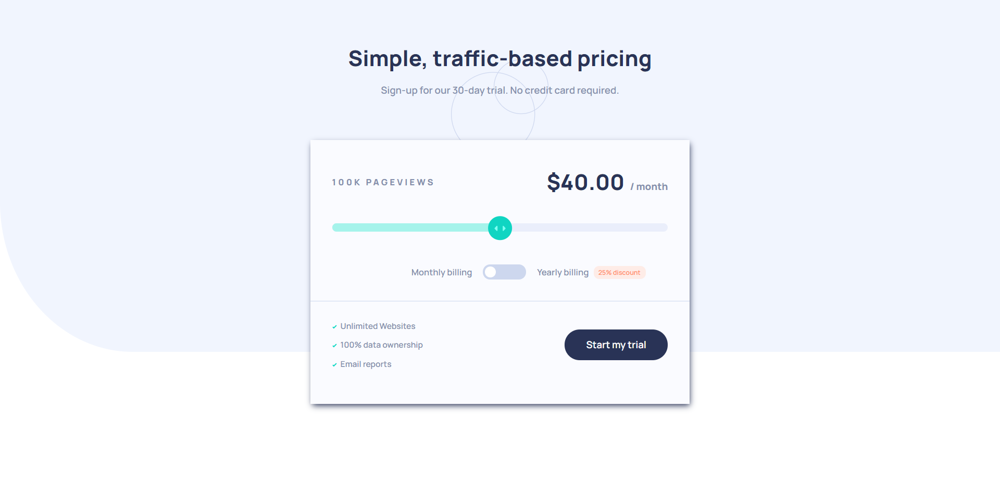

# Frontend Mentor - Interactive pricing component solution

This is a solution to the [Interactive pricing component challenge on Frontend Mentor](https://www.frontendmentor.io/challenges/interactive-pricing-component-t0m8PIyY8).

## Table of contents

- [Overview](#overview)
  - [The challenge](#the-challenge)
  - [Screenshot](#screenshot)
  - [Get Started](#get-started)
  - [Links](#links)
- [My process](#my-process)
  - [Built with](#built-with)
  - [What I learned](#what-i-learned)
- [Author](#author)
- [License](#license)

## Overview

### The challenge

Users should be able to:

- View the optimal layout for the app depending on their device's screen size.
- See hover states for all interactive elements on the page.
- Use the slider and toggle to see prices for different page view numbers.

### Screenshot

;

### Get Started

In order to get started you need to make sure you have [SASS](https://sass-lang.com/) on your machine, if you dont you can run on your bash:

**Obs:** Your can skip this step if you don't want to deal with the SASS files.

```bash
$ npm install sass -g
```

Or, if you prefer to use yarn:

```bash
$ yarn add sass
```

**Obs:** Yarn discourages the use of global packages, but if you truly want or need, you can run:

```bash
$ yarn add global sass
```

Then, proceed to clone the repository using:

```bash
$ git clone https://github.com/whoiscaio/calculator-app.git
```

And you are ready.

### Links

- Solution URL: [Github](https://github.com/whoiscaio/interactive-pricing-component).
- Live Site URL: [Github Pages](https://whoiscaio.github.io/interactive-pricing-component/).

## My process

### Built with

- Semantic HTML5 markup
- CSS
- [SASS](https://sass-lang.com/) - SASS website

### What I learned

This project was very important to me because it led me to understand a new concept, which is draggable elements on javascript in desktop and mobile devices.

```js
    let newPos = currentPos - e.clientX;
    let value = elementStyle.getPropertyValue('left');
    let newLeftValue = parseFloat(value.substr(0, value.length - 2)) - newPos;

    if (newLeftValue >= 0 && newLeftValue <= rightLimit) {
      element.style.left = newLeftValue + 'px';
      filledArea.style.width = newLeftValue + 'px';
    }
``` 

This is only a small fragment of the way i updated the sphere position based on the mouse position, this code fragment is only executed if the user click on the button and move the mouse while the button is active.

## Author

- Frontend Mentor - [@whoiscaio](https://www.frontendmentor.io/profile/whoiscaio)
- Github - [whoiscaio](https://github.com/whoiscaio)
- Linkedin - [Caio Lima](https://www.linkedin.com/in/lima-caio/)

## License

This project is licensed under the MIT License - see the [LICENSE](LICENSE) file for details.
